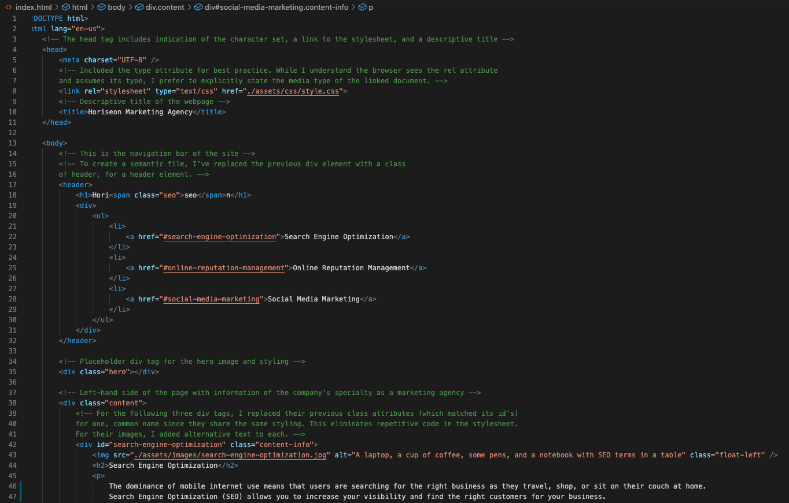
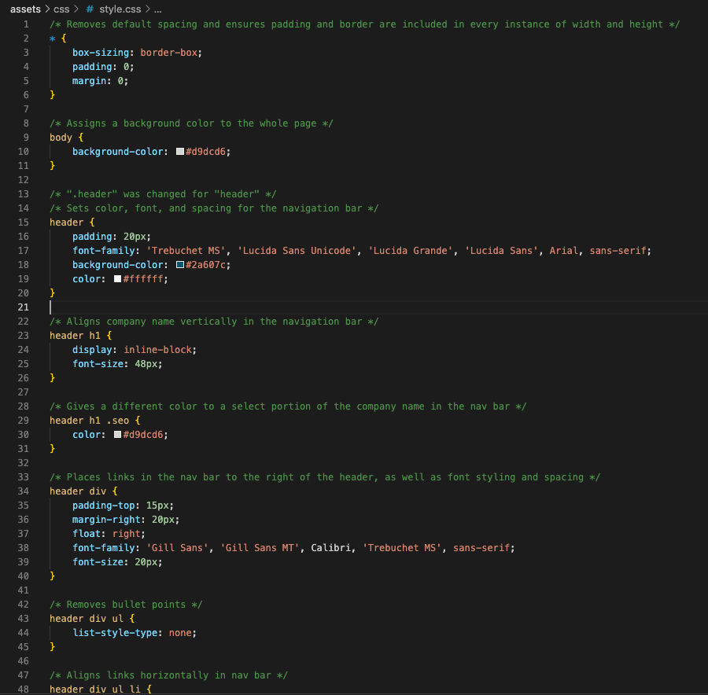

# horiseon-refactoring

## Description

The goal of this project is to refactor a marketing agency's landing page codebase to follow accessibility standards -- so their site is optimized for search engines -- and logical and semantic structure. The website provides information of Horiseon Marketing Agency's marketing specialties and strategies as well as the benefits of partnership.

## The WHY

To assess my understanding of HTML and CSS best practices. The first week of UC Berkeley's coding bootcamp delved into the fundamentals of HTML and CSS with a range of activities that covered building webpages from scratch, adding styling and elements on top of some, and refactoring code that met accessibility and semantic standards. This project defines the outcome of a week's worth of hard work.

## The problems

Changes I implemented:
    1. Transformed `
` elements into their correct semantic element. Example: fromm `
` to `<header>`.
    2. Added alternative text to every image instance.
    3. Correctly linked each link in the navigation bar with its corresponding section of the page.
    4. Removed the existence of several one-instance classes with repeated styling.
    5. Ensured heading elements fall in sequential order.
    6. Reworded the title to be more concise and descriptive.
    7. Adjusted indentation of HTML file for better readability.
    8. Included the `type` attribute to the stylesheet link tag in the head of the HTML file.
    9. Left descriptive comments on both the HTML and CSS files for better readability.

## Technologies

HTML, CSS, and Git

## Future implementations

For better user experience, I would make changes to the UI and implement more interactive functionality. Currently, the user is bombarded with small text and too much information to process in 6 seconds. The website lacks call-to-action elements that prompts the user to connect with the company. The website needs to cleary and easily point out what it is that they do and how they can satify the user's demand. It lacks eye-catching functionality to hook the user.

## Screen captures of source code

## Deployed website link